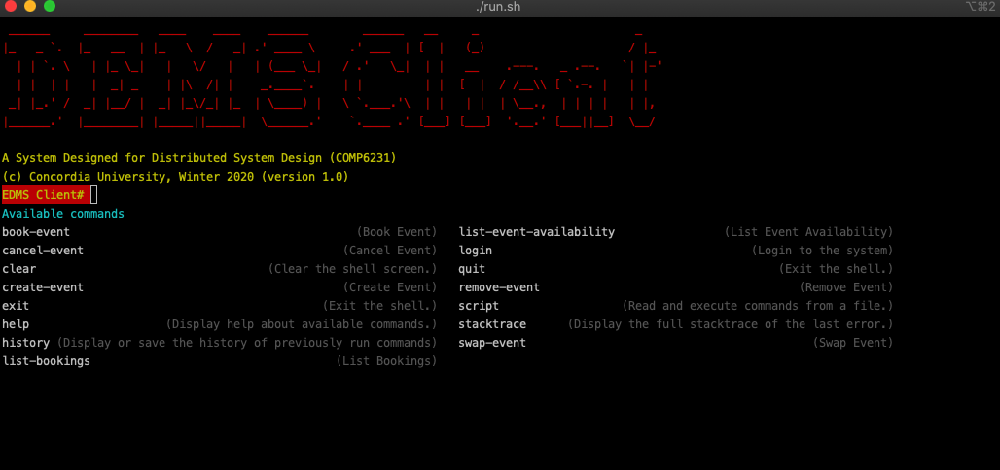
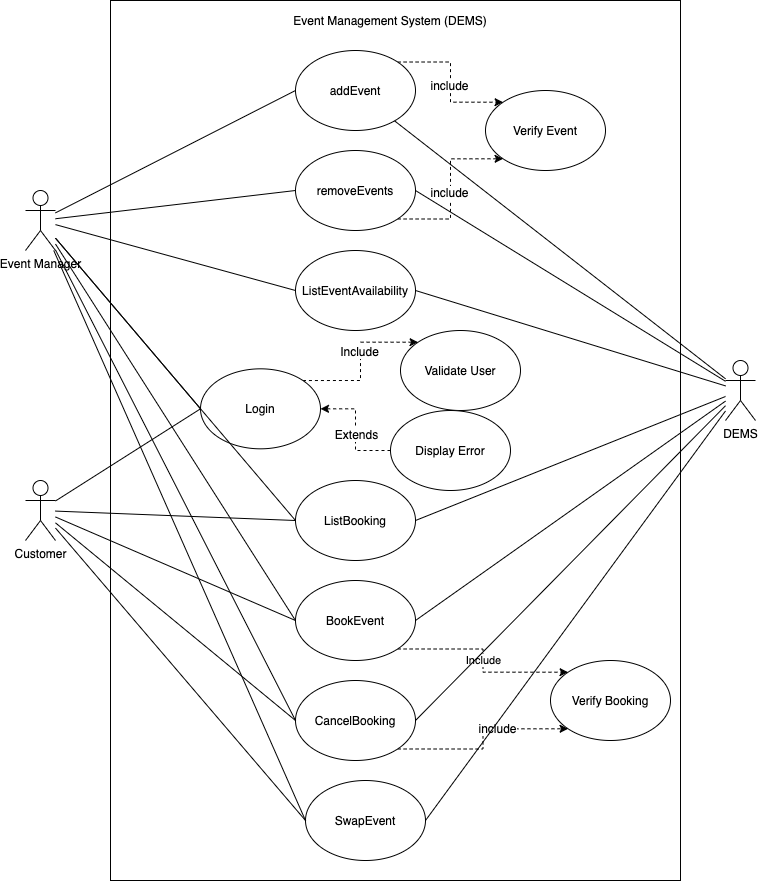
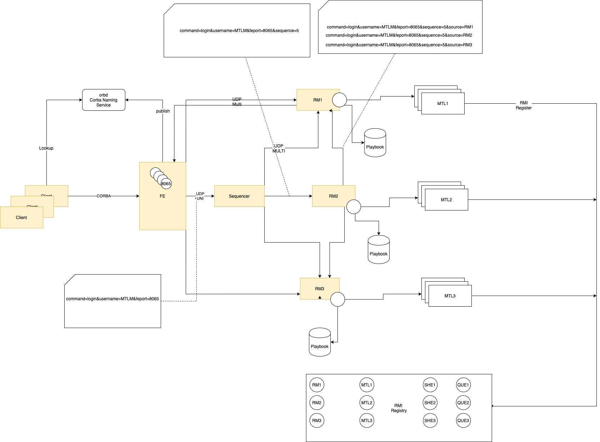

<p>
  
  <a href="https://github.com/wayoubi/RiskGame/wiki">
    
  </a>
  <a href="https://github.com/kefranabg/readme-md-generator/graphs/commit-activity">
    
  </a>
  <h1>Distributed Event Management System with High Availability Fault Tolerance</h1>
  <br/>
  
</p>

## How to Build and Run the System
Make sure you have Maven, github and Java 8 jdk installed on your computer

See how to install git  
[here](https://git-scm.com/book/en/v2/Getting-Started-Installing-Git)

See how to install jdk1.8  
[here](https://docs.oracle.com/javase/8/docs/technotes/guides/install/install_overview.html)

See how to install maven  
[here](https://maven.apache.org/install.html)

Please make sure your Java SDK 1.8 on the path, for example use
```sh 
$ java -version
java version "1.8.0_144"
Java(TM) SE Runtime Environment (build 1.8.0_144-b01)
Java HotSpot(TM) 64-Bit Server VM (build 25.144-b01, mixed mode)
```

Download the source code from github, on your computer open new terminal
```sh 
$ git clone https://github.com/wayoubi/dems-highavailability.git
```

Compile and Build all system components
```sh
cd dems-highavailability
./mvnw.sh clean install 
```
If you are using Windows
```sh
cd dems-highavailability
./mvnw.cmd clean install 
```

Run the Frontend
```sh 
# While you are in the dems-highavailability folder
# Required parameters in order 
# 1 CORBA Naming Serivce Host, default localhost
# 2 CORBA Naming Serivce Port, default 1050
# 3 Sequincer Host, default localhost
# 4 Sequencer Port, default 8080
# 5 Mutlicast IP, dfault 224.0.0.110
# 6 Multicast Port, default 4443
# use run.cmd is you're on Windows

cd frontend
./run.sh localhost 1050 localhost 8080 224.0.0.110 4446
```

Run the Sequencer
```sh 
# While you are in the dems-highavailability folder
# Required parameters in order 
# 1 UDP Unicast Listening Port, default 8080 
# 2 Mutlicast IP, default 224.0.0.110
# 3 Multicast Port, default 4443
# use run.cmd is you're on Windows

cd sequencer
./run.sh 8080 224.0.0.110 4446
```

Run the Replica Manager
```sh 
# While you are in the dems-highavailability folder
# Required parameters in order
# 1 Replica Manager Name, default RM$ where $ is 1,2,3 and so on
# 2 Mutlicast IP, default 224.0.0.110
# 3 Multicast Port, default 4443 
# use run.cmd is you're on Windows

cd replica-manager
./run.sh RM1 224.0.0.110 4446 localhost
```

Run the DMES Server
```sh 
# //TODO incomplete yet
```

## Introduction
The Distributed Event Management System (DEMS) is an event management solution designed to help businesses to manage events and bookings over remote locations (cities) in a client server and peer to peer architecture style. The events database of each city is stored in the local server of that location offering high availability and avoiding single point of failure. The system is designed to support concurrency, low latency and thread safety. The system is designed and implemented to be presented for the assignments and the project required for Distributed System Design [COMP 6231] course offered during Winter 2020 at Concordia University. 

The two major functional requirements of the system are to manage events (create, update, remove and list), Events Management should be performed by Managers only. On the other hand, Booking Management (Make, Cancel and List Bookings) can be performed by both Event Managers and Costumers. The following Use Case diagram showing the use cases (functional requirements) of DEMS



## Architecture


